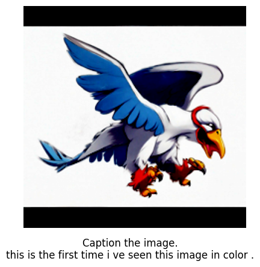
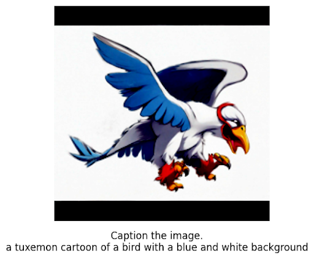
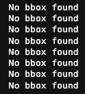
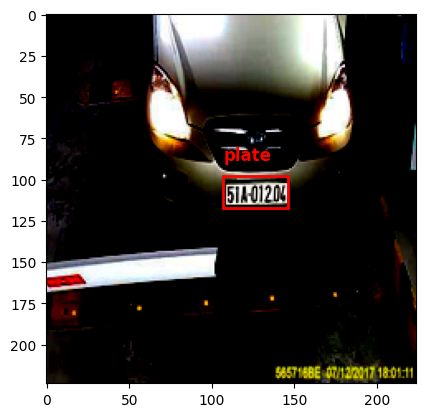

# Fine Tuning PaliGemma

## What is SigLIP

We (/w Ritwik Raha) have covered SigLIP in depth in our blog [Choosing Between SigLIP and CLIP for Language Image Pretraining](https://blog.ritwikraha.dev/choosing-between-siglip-and-clip-for-language-image-pretraining).

## What is PaliGemma?

[PaliGemma](https://ai.google.dev/gemma/docs/paligemma) is a new family of
vision-language models from Google. These models can process both images and
text to produce text outputs.

Google has released three types of PaliGemma models:
1. Pretrained (pt) models: Trained on large datasets without task-specific tuning.
2. Mix models: A combination of pre-trained and fine-tuned elements.
3. Fine-tuned (ft) models: Optimized for specific tasks with additional training.

Each type comes in different resolutions and multiple precisions for
convenience. All models are available on the
[Hugging Face Hub](https://huggingface.co/collections/google/paligemma-release-6643a9ffbf57de2ae0448dda)
with model cards, licenses, and integration with transformers.

## Fine-Tuning Methods

1. [JAX Fine-Tuning Script](https://colab.research.google.com/github/google-research/big_vision/blob/main/big_vision/configs/proj/paligemma/finetune_paligemma.ipynb)
2. [Fine-tuning using HuggingFace transformers](https://huggingface.co/blog/paligemma#using-transformers-1)
3. Fine-tuning using Vanilla Pytorch scripts (shown here)
  a. Fine tune with an Image Captioning Dataset (vanilla_ft.py)
  b. Fine tune with an Object Detection Dataset (object_detection_ft.py)

## Results

### Image Captioning

In the script provided we have used the [`tuxemon`](https://huggingface.co/datasets/diffusers/tuxemon)
dataset, from the diffusers team. The dataset comprises of images of tuxemons (a spin off of pokemons)
and their captions.

| Before Fine Tuning | After Fine Tuning |
|---|---|
|  |  |


### Object Detection

While I could not find a document that provides pointers to train the model
on a detection dataset, diving in the official
[big vision space](https://huggingface.co/spaces/big-vision/paligemma) made it
really clear. Taking inspiration from the space, I have create a script to format
any object detection dataset (here the dataset is based on the coco format)
to the format PaliGemma is trained on.

You can find the dataset creation script here: `create_od_dataset.py`.

After the dataset is created run the fine tuning script `object_detection_ft.py`
and run the model.

| Before Fine Tuning | After Fine Tuning |
|---|---|
|  |  |

## Further Reading
If you want to read more about PaliGemma and SigLip we have written two blogposts on the topic:
- [Understanding PaliGemma](https://blog.ritwikraha.dev/understanding-paligemma-in-50-minutes-or-less)
- [SigLip vs CLIP](https://blog.ritwikraha.dev/choosing-between-siglip-and-clip-for-language-image-pretraining)
## Citation
If you like our work and would use it please cite us! ^_^
```
@misc{github_repository,
  author = {Aritra Roy Gosthipaty, Ritwik Raha}, 
  title = {ft-pali-gemma}, 
  publisher = {{GitHub}(https://github.com)},
  howpublished = {\url{https://github.com/ariG23498/ft-pali-gemma/edit/main/README.md}},
  year = {2024}  
}
```
